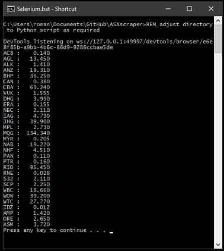

# ASX scraper

How to install and run a python script that uses Selenium to automatically collect/scrape EOD settlement prices for a list of shares. This is a a rewrite of previous code that stopped working due to "upgrades" to ASX websites that previously worked with Beautifull Soup.

-- NOTE: Some of the directories have changed but the principle remains --

## **Contents -**

- [Assumptions](#Assumptions)
- [Download Python with IDLE and pip](#Download-Python-with-IDLE-and-pip)
- [Install the Selenium Python module](#Install-the-Selenium-Python-module)
- [Install the openpyxl Python module](#Install-the-openpyxl-Python-module)
- [Install the Chrome Driver](#Install-the-Chrome-Driver)
- [Get the Excel workbook](#Get-the-Excel-workbook)
- [Get and use the Python Script](#Get-and-use-the-Python-Script)
- [Get and use the Batch file](#Get-and-use-the-Batch-file)

## **Assumptions**

 - We use a Windows 10 PC with internet
 - The Google Chrome browser is installed
 - Microsoft Excel is installed
 - The **C:\Users\roman\Documents\GitHub\ASXscraper** will be the working directory. It is arbitrary but if a different one is used it must be changed consistently. Also any documents/setting that refer to it must be modified accordingly.

## **Download Python with IDLE and pip**

- Go to https://www.python.org/downloads/windows/
- For the latest Stable Releases download: **Windows x86-64 executable installer** or **Windows x86 executable installer** as appropriate
- Run the installer with the default directory path and both options ticked:

  
- Create Desktop Shortcut for running IDLE
  - There are several ways of doing this. The easiest being to drag the IDLE icon from the start menu (Left mouse button click on Window Icon on the Task Bar) to the desktop:

    
  - Once run select **File=>Path Browser**. This lets you see where everything is located.

## **Install the Selenium Python module**

This enables python to interact with websites.

- Open the command terminal by running the Command Prompt App. You can find it by typing **Command Prompt** in the Search bar. Now type the following and press the Enter key:
  ``` 
  python -m pip install selenium
  ```
- If not already installed you should see something like this in the terminal window.

  
- The directory from which you run the above is irrelevant.
- You can confirm installation by looking for Selenium* directories in
**C:\Users\roman\AppData\Local\Programs\Python\Python39\Lib\site-packages**

  

## **Install the openpyxl Python module**

This enables python to interact with Excel workbooks.

- In command terminal run
  ``` 
  python -m pip install openpyxl
  ```
- If not already installed you should see something like this in the terminal window

  
- You can confirm installation analagously to Selenium above.

## **Install the Chrome Driver**

This an interface used by Selenium to control the Chrome browser. You need a version consistent with your version of Chrome.

- Find out which version of the Chrome browser you are using.
  - In the browser window click the three-dot icon in the top-right corner and select **Help=>About Google Chrome**

    
  - The first two numbers are relevant (in our case 86 above)

- Go to https://chromedriver.chromium.org/downloads
  - Click on the link to the relevant driver version. In our case: **ChromeDriver 86.0.4240.22**
  https://chromedriver.storage.googleapis.com/index.html?path=86.0.4240.22/
  - Download **chromedriver_win32.zip**
  - Extract this zip file into the directory **C:\Users\roman\Documents\GitHub\ASXscraper**. This might need to be created and can be changed, but you must do so consistently.

    

  - NOTE: If the version has not changed you can download it from [HERE](chromedriver.exe)

## **Get the Excel workbook**

This is where the EOD share prices are loaded into when the python script is run. It is a workbook called **Shares.xlsx**

- Download it from [HERE](Shares.xlsx) into the directory **C:\Users\roman\Documents\GitHub\ASXscraper**.
  - You can create it yourself as long as it has a **Shares** worksheet.
- This directory might need to be created and can be changed, but you must do so consistently.

## **Get and use the Python Script**

This is **THE** Python script that you run to download share prices. It assumes you have performed all the above installations. It is called **ASX_Selenium_scraper.py**

```python
from selenium import webdriver
from selenium.webdriver.common.keys import Keys
import openpyxl
import time

# List of ASX codes for which EOD sellement prices will be obtained. Adjust as desired.
ASXshareslist = [['AC8',0],['AGL',0],['ALK',0],['ANZ',0],['BHP',0],
                 ['CAN',0],['CBA',0],['VUK',0],['DHG',0],['ERA',0],
                 ['NEC',0],['IAG',0],['JHG',0],['MPL',0],['MQG',0],
                 ['MYR',0],['NAB',0],['NHF',0],['PAN',0],['PTR',0],
                 ['RIO',0],['RNE',0],['S32',0],['SCP',0],['WBC',0],
                 ['WOW',0],['WTC',0],['IDZ',0],['AMP',0],['ORE',0],
                 ['ASM',0]]

# location of Chrome driver. Adjust as necessary.
driver = webdriver.Chrome('C:\\Users\\roman\\Documents\\GitHub\\ASXscraper\\chromedriver.exe')

# location of Excel workbook where price data is saved. Adjust as necessary.
fn = "C:\\Users\\roman\\Documents\\GitHub\\ASXscraper\\Shares.xlsx"

# open above workbook so that data can be added
wb = openpyxl.load_workbook(fn)

# Worksheet assumed to exist in Above Excel workbook
ws = wb['Shares'] 

i=2
for x in ASXshareslist:
    i = i+1

    # ASX share code being considered
    sShare = x[0]

    # loops through ASX web pages that contain EOD share prices
    driver.get('https://www2.asx.com.au/markets/company/'+sShare)
    # need delay to alLow time for web page to fully load
    time.sleep(3)
    # this is the 'magik' tag that finds the string that contains the price (and some other data)
    el = driver.find_element_by_tag_name("dd").text
    ela = el.split()
    
    # ASX EOD share price is collected and formatted
    # price is the first piece of 'blank' seperated data
    fPrice = float(ela[0])
    # price saved here for potential future code enhancements
    x[1] = fPrice
    sPrice = '{:7.3f}'.format(fPrice)
    print(sShare+' : ',sPrice)

    # populating Excel workbook cells for considered share
    # This code can be expanded/modified as desired.
    cr = ws.cell(row=i, column=2)
    cr.value=sShare
    cr = ws.cell(row=i, column=3)
    cr.value=fPrice

# Save Excel workbook
wb.save(fn)

# close interface to Chrome browser
driver.close()
```

- Download it from [HERE](ASX_Selenium_scraper.py) into the directory **C:\Users\roman\Documents\GitHub\ASXscraper**.
- This directory might need to be created and can be changed, but you must do so consistently.
- At this point you should be able to succesfully run this Python script from IDLE:

  

- When completed (it takes some time) open the Excel workbook to see the updated price data in the **Shares** worksheet.

## **Get and use the Batch file**

This is a convenient way to run the Python script via a Desktop Link insead of from IDLE.

- Download the batch file **Selenium.bat** from [HERE](Selenium.bat) into the directory:  **C:\Users\roman\Documents\GitHub\ASXscraper**.

  ```
  REM adjust directory to Python script as required
  @py.exe C:\Users\roman\Documents\GitHub\ASXscraper\ASX_Selenium_scraper.py %*
  @pause
  ```

- This directory might need to be created and can be changed, but you must do so consistently.
- Once **Selenium.bat** is downloaded, create a shortcut from its directory and drag it to the desktop. This can then be pressed to conveniently run the Python script.

  

- When run the progress will be visible in a created terminal window. Close it after completion:

  