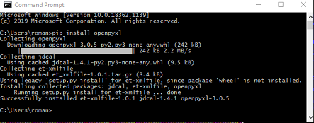

# ASX scraper

Basic python program that uses Selenium to automatically collect EOD settlement prices for a list of shares. This is a a rewrite of previous code that does not work due to "upgrades" to the ASX websites that previously worked with Beautifull Soup.

## Assumptions

 - We use a Windows 10 PC with internet
 - Google Chrome browser is installed
 - MS Excel is installed

## Download Python with IDLE and pip

- Go to https://www.python.org/downloads/windows/
- For the latest Stable Releases download: **Windows x86-64 executable installer** or **Windows x86 executable installer** as appropriate
- Run the installer with the default directory path and both options ticked:

  
- Create Desktop Shortcut for running IDLE
  - There are several ways of doing this. The easiest being to drag the IDLE icon from the start menu (Left mouse button click on Window Icon on the Task Bar) to the desktop:

    
  - Once run select **File=>Path Browser**. This lets you see where everything is located.

## Install the Selenium Python module

This enables python to interact with websites.

- Open the command terminal by running the Command Prompt App. You can find it by typing **Command Prompt** in the Search bar. Now type the following and press the Enter key:
  ``` 
  python -m pip install selenium
  ```
- If not already installed you should see something like this in the terminal window.

  
- The directory from which you run the above is irrelevant.
- You can confirm installation by looking for Selenium* directories in
**C:\Users\roman\AppData\Local\Programs\Python\Python39\Lib\site-packages**

  

## Install the openpyxl Python module

This enables python to interact with Excel workbooks.

- In command terminal run
  ``` 
  python -m pip install openpyxl
  ```
- If not already installed you should see something like this in the terminal window

  
- You can confirm installation analagously to Selenium above.

## Install the Chrome Drive

This an interface used by Selenium to control the Chrome browser. You need a version consistent with your version of Chrome.

- Find our which version of the Chrome browser you are using.
  - In the browser window click the three-dot icon in the top-right corner and select **Help=>About Google Chrome**

    
  - The first two numbers are relevant (in our case 86 above)

- Go to https://chromedriver.chromium.org/downloads
  - Click on the link to the relevant driver version. In our case: **ChromeDriver 86.0.4240.22**
  https://chromedriver.storage.googleapis.com/index.html?path=86.0.4240.22/
  - Download **chromedriver_win32.zip**

